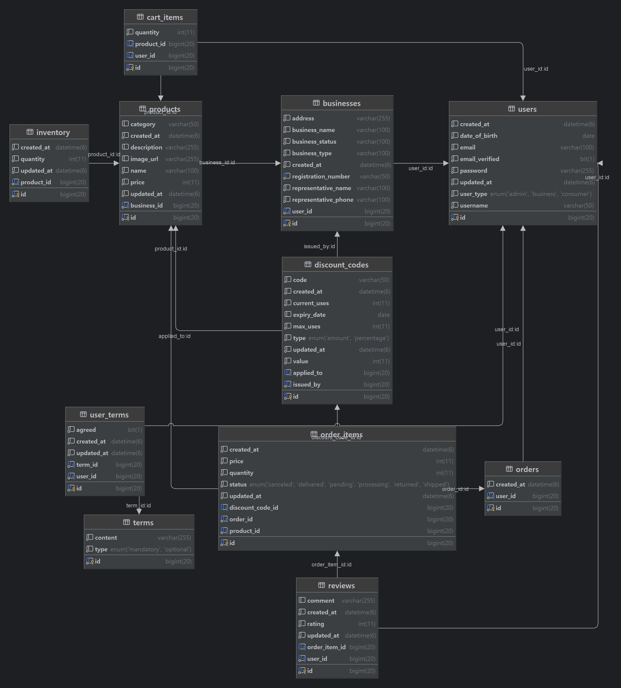

# Commerce Platform

---

## 목차

- [프로젝트 설명](#프로젝트-설명)
- [기능](#기능)
- [사용 기술](#사용-기술)
- [ERD 설명](#erd-설명)
- [테이블 설명](#테이블-설명)
- [추가 구현 예정](#추가-구현-예정)

---

## 프로젝트 설명

이 프로젝트는 온라인 쇼핑몰 재고 관리 시스템으로, 각 사업자가 자신의 재고와 주문을 효율적으로 관리할 수 있도록 지원합니다. 공공데이터포털 API를 활용한 사업자 등록 정보
진위확인, 이메일 인증과 알림 기능을 제공하며, 결제와 할인코드 적용의 기능도 제공합니다.

--- 

## 기능

### User 기능

- 회원 가입
  - (소비자) ID, PW, Email, 이름, 생년월일
  - (사업자) ID, PW, Email, 이름, 생년월일, 사업체 정보
  - [공공데이터포털 API](https://www.data.go.kr/data/15081808/openapi.do)를 활용한 사업자등록정보
    진위확인 ([명세](#공공데이터포털-사업자등럭정보-진위확인-API-명세))
  - 이메일 인증
  - 필수, 선택 약관 동의
- 로그인
  - JWT 토큰을 사용한 인증 및 세션 관리
  - 로그인 실패 횟수에 따른 계정 잠금 (잠금 상태 알림)
  - 이메일 인증을 통한 비밀번호 복구
- 사용자 활동
  - 로그인 위치 정보 기록
  - 재고 등록/수정/삭제 기록

### 재고관리 기능

- 재고 등록, 수정, 삭제
- 재고 조회 및 검색
- 재고 변경 내역 기록
- 재고 부족 알림

### 상품관리 기능

- 상품 등록, 수정, 삭제
- 상품 상세 정보 관리 (가격, 설명, 이미지 등)
- 상품 카테고리 관리

### 주문내역 기능

- 주문 조회
- 주문 상태 업데이트
- 주문 이메일 알림 기능

### 할인코드 기능

- 할인코드 생성 및 관리
  - 코드, 할인 유형(금액/비율), 유형에 따른 할인 값, 만료일, 총 수량, 사용된 수량
- 할인코드 적용
  - 주문 시 할인코드 입력 및 검증
  - 유효한 할인코드의 경우 할인 적용
- 사용된 수량 업데이트
- 자동 만료 처리

### 소비자 기능

- 상품 검색 및 조회
  - 카테고리별, 가격대별 상품 검색
  - 상세 상품 정보 조회
- 장바구니
  - 상품을 장바구니에 추가/삭제
  - 장바구니 내 상품 수량 수정
- 주문
  - 주문 생성 및 결제 (모의 결제 서비스: Stripe API)
  - 주문 내역 조회 및 상태 확인

### 기타

- 역할 및 권한 관리: 다양한 역할(관리자, 직원 등)과 권한 설정
- Swagger: API 문서화
- Redis: 세션 관리, 재고 상태 및 재고 알림, 할인코드 검증
- Elasticsearch: 재고관리 기능, 대시보드 기능, 상품 검색 및 조회
- Amazon S3: 상품 설명 이미지 등록

---

## 사용 기술

- **백엔드**: Spring Boot, JPA, Hibernate
- **데이터베이스**: MariaDB, Redis, Elasticsearch
- **클라우드**: Amazon S3
- **보안**: JWT, OAuth (카카오 로그인)
- **API 문서화**: Swagger

---

## ERD 설명

아래는 이 프로젝트의 ERD(Entity-Relationship Diagram)입니다.



---

## 테이블 설명

### Terms

| 필드 이름   | 데이터 타입                | 설명                              |
|---------|-----------------------|---------------------------------|
| id      | bigint auto_increment | Primary key                     |
| content | varchar(255)          | 약관 내용                           |
| type    | enum                  | 약관 유형 (`MANDATORY`, `OPTIONAL`) |

### Users

| 필드 이름          | 데이터 타입                | 설명                                       |
|----------------|-----------------------|------------------------------------------|
| id             | bigint auto_increment | Primary key                              |
| created_at     | datetime(6)           | 생성 일자                                    |
| date_of_birth  | date                  | 생년월일                                     |
| email          | varchar(100)          | 이메일 주소                                   |
| email_verified | bit                   | 이메일 인증 여부                                |
| password       | varchar(255)          | 비밀번호                                     |
| updated_at     | datetime(6)           | 업데이트 일자                                  |
| user_type      | enum                  | 사용자 유형 (`ADMIN`, `BUSINESS`, `CONSUMER`) |
| username       | varchar(50)           | 사용자 이름                                   |

### Businesses

| 필드 이름                | 데이터 타입                | 설명                     |
|----------------------|-----------------------|------------------------|
| id                   | bigint auto_increment | Primary key            |
| address              | varchar(255)          | 주소                     |
| business_name        | varchar(100)          | 상호명                    |
| business_status      | varchar(100)          | 사업 상태                  |
| business_type        | varchar(100)          | 사업 유형                  |
| created_at           | datetime(6)           | 생성 일자                  |
| registration_number  | varchar(50)           | 사업자 등록번호               |
| representative_name  | varchar(100)          | 대표자 이름                 |
| representative_phone | varchar(100)          | 대표자 전화번호               |
| user_id              | bigint                | Foreign key (users.id) |

### Orders

| 필드 이름      | 데이터 타입                | 설명                     |
|------------|-----------------------|------------------------|
| id         | bigint auto_increment | Primary key            |
| created_at | datetime(6)           | 생성 일자                  |
| user_id    | bigint                | Foreign key (users.id) |

### Products

| 필드 이름       | 데이터 타입                | 설명                          |
|-------------|-----------------------|-----------------------------|
| id          | bigint auto_increment | Primary key                 |
| category    | varchar(50)           | 카테고리                        |
| created_at  | datetime(6)           | 생성 일자                       |
| description | varchar(255)          | 설명                          |
| image_url   | varchar(255)          | 이미지 URL                     |
| name        | varchar(100)          | 상품명                         |
| price       | int                   | 가격                          |
| updated_at  | datetime(6)           | 업데이트 일자                     |
| business_id | bigint                | Foreign key (businesses.id) |

### Cart Items

| 필드 이름      | 데이터 타입                | 설명                        |
|------------|-----------------------|---------------------------|
| id         | bigint auto_increment | Primary key               |
| quantity   | int                   | 수량                        |
| product_id | bigint                | Foreign key (products.id) |
| user_id    | bigint                | Foreign key (users.id)    |

### Discount Codes

| 필드 이름        | 데이터 타입                | 설명                             |
|--------------|-----------------------|--------------------------------|
| id           | bigint auto_increment | Primary key                    |
| code         | varchar(50)           | 할인 코드                          |
| created_at   | datetime(6)           | 생성 일자                          |
| current_uses | int                   | 현재 사용 횟수                       |
| expiry_date  | date                  | 만료 일자                          |
| max_uses     | int                   | 최대 사용 횟수                       |
| type         | enum                  | 할인 유형 (`AMOUNT`, `PERCENTAGE`) |
| updated_at   | datetime(6)           | 업데이트 일자                        |
| value        | int                   | 할인 값                           |
| applied_to   | bigint                | Foreign key (products.id)      |
| issued_by    | bigint                | Foreign key (businesses.id)    |

### Order Items

| 필드 이름            | 데이터 타입                | 설명                                                                              |
|------------------|-----------------------|---------------------------------------------------------------------------------|
| id               | bigint auto_increment | Primary key                                                                     |
| created_at       | datetime(6)           | 생성 일자                                                                           |
| price            | int                   | 가격                                                                              |
| quantity         | int                   | 수량                                                                              |
| status           | enum                  | 주문 상태 (`CANCELED`, `DELIVERED`, `PENDING`, `PROCESSING`, `RETURNED`, `SHIPPED`) |
| updated_at       | datetime(6)           | 업데이트 일자                                                                         |
| discount_code_id | bigint                | Foreign key (discount_codes.id)                                                 |
| order_id         | bigint                | Foreign key (orders.id)                                                         |
| product_id       | bigint                | Foreign key (products.id)                                                       |

### Reviews

| 필드 이름         | 데이터 타입                | 설명                           |
|---------------|-----------------------|------------------------------|
| id            | bigint auto_increment | Primary key                  |
| comment       | varchar(255)          | 리뷰 댓글                        |
| created_at    | datetime(6)           | 생성 일자                        |
| rating        | int                   | 평점                           |
| updated_at    | datetime(6)           | 업데이트 일자                      |
| order_item_id | bigint                | Foreign key (order_items.id) |
| user_id       | bigint                | Foreign key (users.id)       |

### User Terms

| 필드 이름      | 데이터 타입                | 설명                     |
|------------|-----------------------|------------------------|
| id         | bigint auto_increment | Primary key            |
| agreed     | bit                   | 동의 여부                  |
| created_at | datetime(6)           | 생성 일자                  |
| updated_at | datetime(6)           | 업데이트 일자                |
| term_id    | bigint                | Foreign key (terms.id) |
| user_id    | bigint                | Foreign key (users.id) |

### Inventory

| 필드 이름      | 데이터 타입                | 설명                        |
|------------|-----------------------|---------------------------|
| id         | bigint auto_increment | Primary key               |
| product_id | bigint                | Foreign key (products.id) |
| quantity   | int                   | 재고 수량                     |
| created_at | datetime(6)           | 생성 일자                     |
| updated_at | datetime(6)           | 업데이트 일자                   |

---

## 추가 구현 예정

### User 기능

- 회원 가입
  - 카카오 로그인 API를 활용한 회원가입
- 로그인
  - 카카오 엑세스 토큰을 사용한 인증 및 세션 관리
- 사용자 활동
  - 로그인 위치 정보 기록
  - 재고 등록/수정/삭제 기록

### 주문내역 기능

- 취소 및 환불 처리

### 할인코드 기능

- 할인코드 조건
  - 특정 조건(최소 주문 금액, 특정 상품 등)에 맞는 할인코드 적용

### 소비자 기능

- 주문
  - 환불 신청

### 대시보드 기능

- 전체 재고 현황 및 통계
- 판매 현황 및 분석: 판매 데이터를 분석하여 주간/월간 판매 보고서 생성
- 재고 예측: 판매 데이터를 분석하여 향후 재고 필요량 예측
- 사용자 맞춤형 대시보드: 사용자가 원하는 정보를 대시보드에 커스터마이즈하여 표시

---

## 공공데이터포털 사업자등럭정보 진위확인 API 명세

```json
{
  // 요청
  "businesses": [
    {
      "b_no": "0000000000",
      // 사업자 등록 번호 (필수)
      "start_dt": "20000101",
      // 사업 시작 일자 (필수)
      "p_nm": "홍길동",
      // 대표자 이름 (필수)
      "p_nm2": "",
      // 대표자 이름 2 (외국인 사업자의 경우 한글명칭)
      "b_nm": "(주)테스트",
      // 사업체 이름
      "corp_no": "0000000000000",
      // 법인 번호
      "b_sector": "",
      // 업종
      "b_type": "",
      // 사업 종류
      "b_adr": ""
      // 사업장 주소
    }
  ]
}
```

```json
{
  // 정상 호출
  "status_code": "OK",
  "request_cnt": 0,
  "valid_cnt": 0,
  "data": [
    {
      "b_no": "0000000000",
      "valid": "01",
      "valid_msg": "",
      "request_param": {
        "b_no": "0000000000",
        "start_dt": "20000101",
        "p_nm": "홍길동",
        "p_nm2": "홍길동",
        "b_nm": "(주)테스트",
        "corp_no": "0000000000000",
        "b_sector": "",
        "b_type": "",
        "b_adr": ""
      },
      "status": {
        "b_no": "0000000000",
        "b_stt": "계속사업자",
        "b_stt_cd": "01",
        "tax_type": "부가가치세 일반과세자",
        "tax_type_cd": "01",
        "end_dt": "20000101",
        "utcc_yn": "Y",
        "tax_type_change_dt": "20000101",
        "invoice_apply_dt": "20000101",
        "rbf_tax_type": "부가가치세 일반과세자",
        "rbf_tax_type_cd": "01"
      }
    }
  ]
}
```


